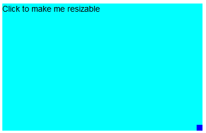
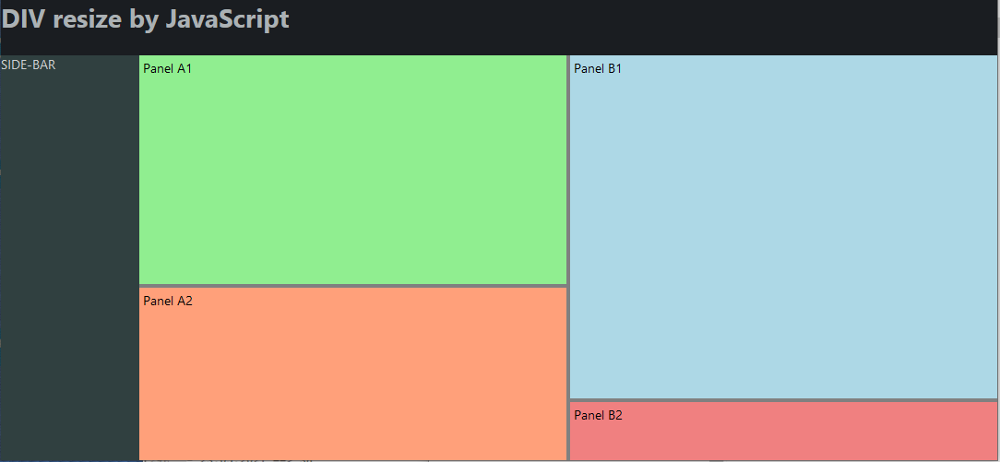

# html-div-resizing

*This project contains HTML5/CSS3/ECMAScript code samples how to implements resizable DIVs.*

## Iteration 1

- One DIV with a click handler, that adds a small blue resize handler to resize the DIV in both directions

## Iteration 2

- Four DIVs (panels) with vertical and horizontal resize bars
- The four DIVs are located within a content area, that does not use the complete window (sidebar and header is also present)
- Each panel can be resized
- During resizing the color of the bar is changed to red
- There is a minimal and maximal limit, so that no panel disappears
- The solution handles also resize events of the window itself

