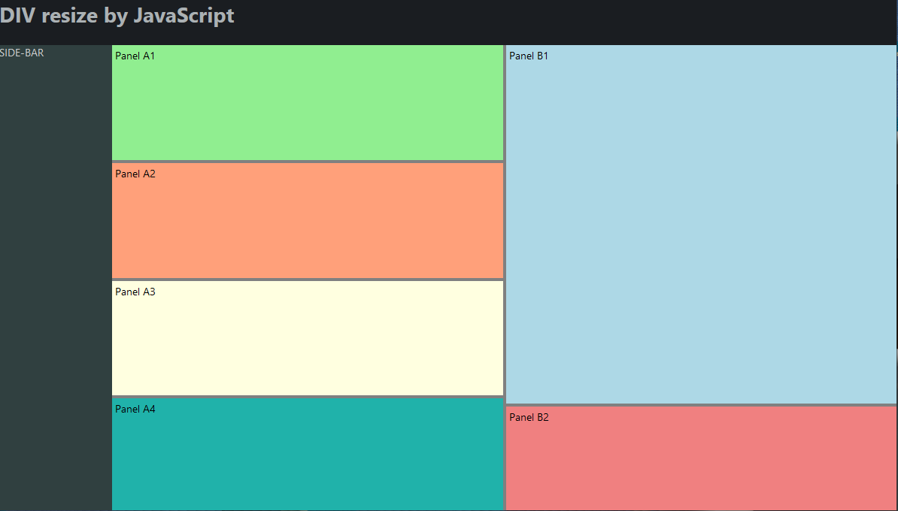

# html-div-resizing

*This project contains HTML5/CSS3/ECMAScript code samples how to implements resizable DIVs.*

## Iteration 1 - "a simple click-and-resize handler"

- One DIV with a click handler, that adds a small blue resize handler to resize the DIV in both directions

## Iteration 2 - "resizing horizontal and vertical between 2 DIVs"

- Four DIVs (panels) with vertical and horizontal resize bars
- The four DIVs are located within a content area, that does not use the complete window (sidebar and header is also present)
- Each panel can be resized
- During resizing the color of the bar is changed to red
- There is a minimal and maximal limit, so that no panel disappears
- The solution handles also resize events of the window itself

## Iteration 3 - "resizing horizontal and vertical between MULTIPLE DIVs"

- Six DIVs (4 in the left column, 2 in the right column)
- Each row or column can have multiple resizable div, not only two
- The color of the resize handle is controlled completely by CSS `:hover` and `:active`

## Iteration 4 - "resizing with containers containing complex HTML elements"

- Again six DIVs in total as in iteration 3
- The left four DIVs contain now instances of [Monaco Editor](https://microsoft.github.io/monaco-editor/) to display JSON-Schema, JSON, HTML and CSS.
  This is basically the preparation for my [Thymeleaf Preview Editor](https://github.com/giraone/thymeleaf-preview-editor).
- The two right DIVs contain HTML &lt;pre&gt; elements.
- The challenge in this iteration is now:
  - Allow resizing of the contained Monaco Editors and HTML &lt;pre&gt; elements from the outside resize handler.
  - Automatic switching to scrollbars, when the inner content is larger than the resized outer container.
- For simplicity, the sidebar was removed.

### Details
- Resizing of inner elements:
  - For the &lt;pre&gt; elements, this is achieved by setting the height to `height: calc(100% - var(--scrollbar-size));`
